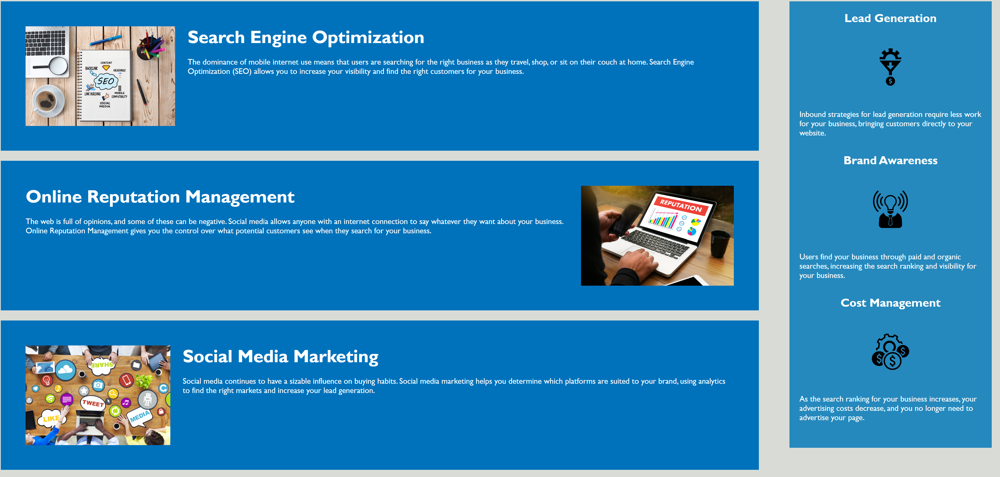

#Horiseon: Code Refactor for Accessibility

##Description

The webpage needed to be more accessible and also needed added structure. This was done by doing the following:
    - Changing the source code to contain semantic HTML elements
    - The structure was configured to allow elements to flow logically and independtly of style and positioning
    - ALT text has been added to images
    - Heading attributes are now in sequential order
    - The title is now clear and concise

##Links

https://bragonese1.github.io/horiseon-seo/

https://github.com/bragonese1/horiseon-seo

##Installation

This page was uploaded using GitHub pages.

##Usage

After the changes made to the code, the webpage is now more accessible.

